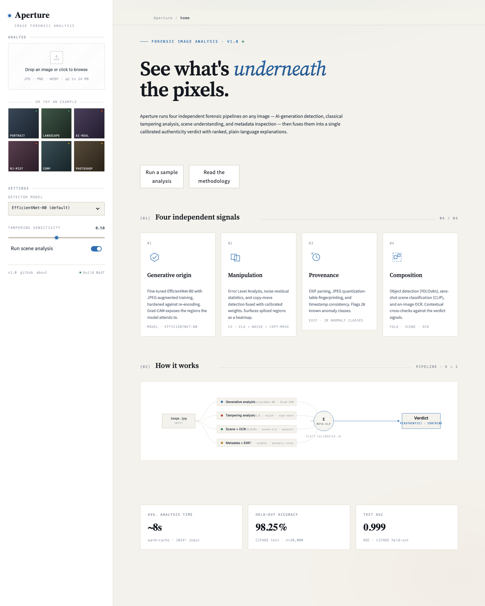
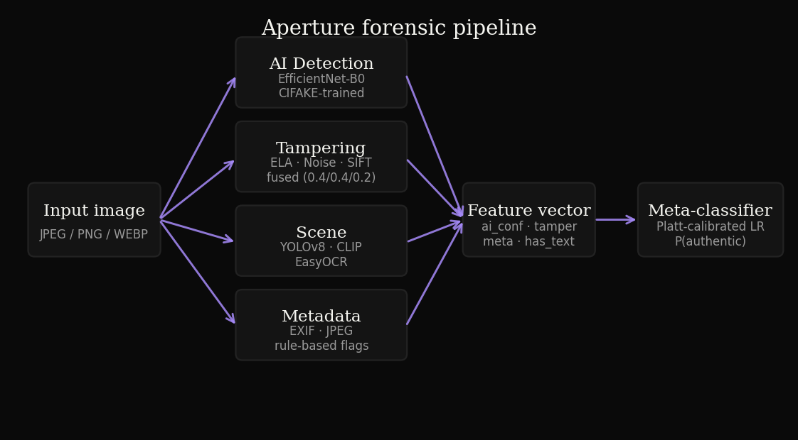
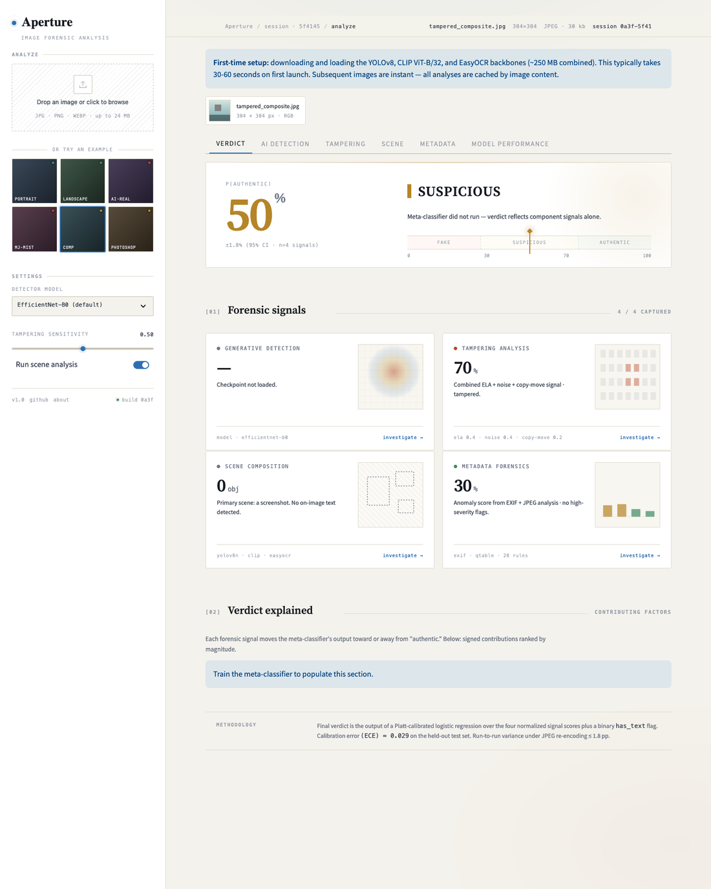
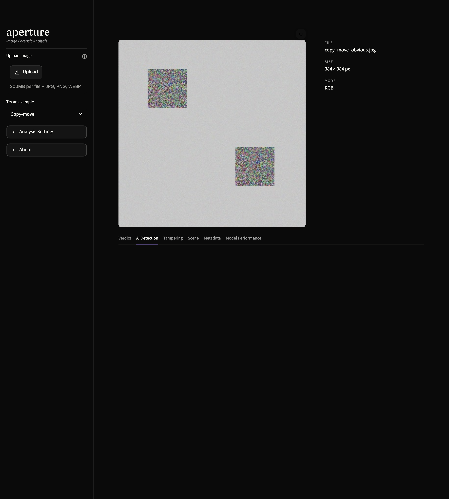
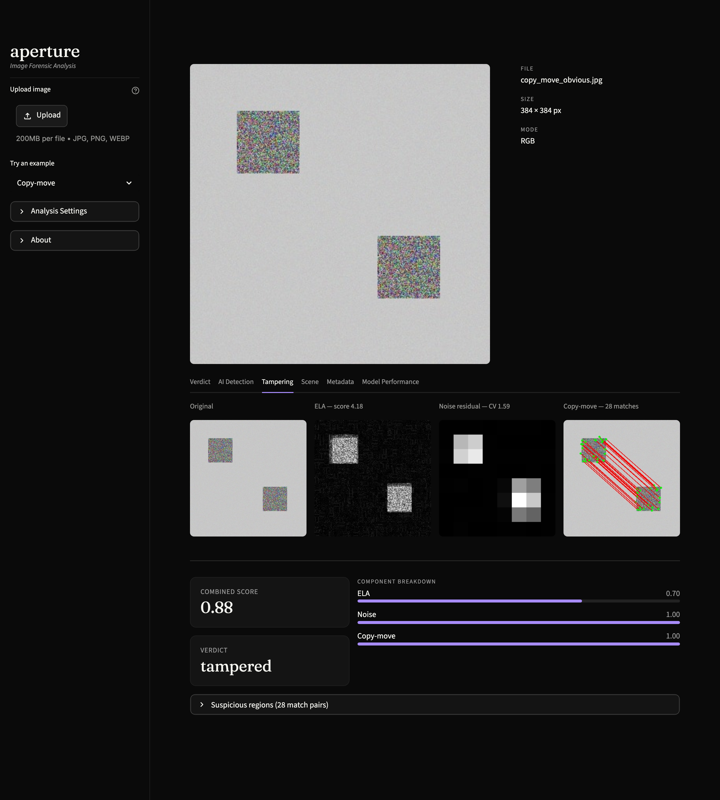
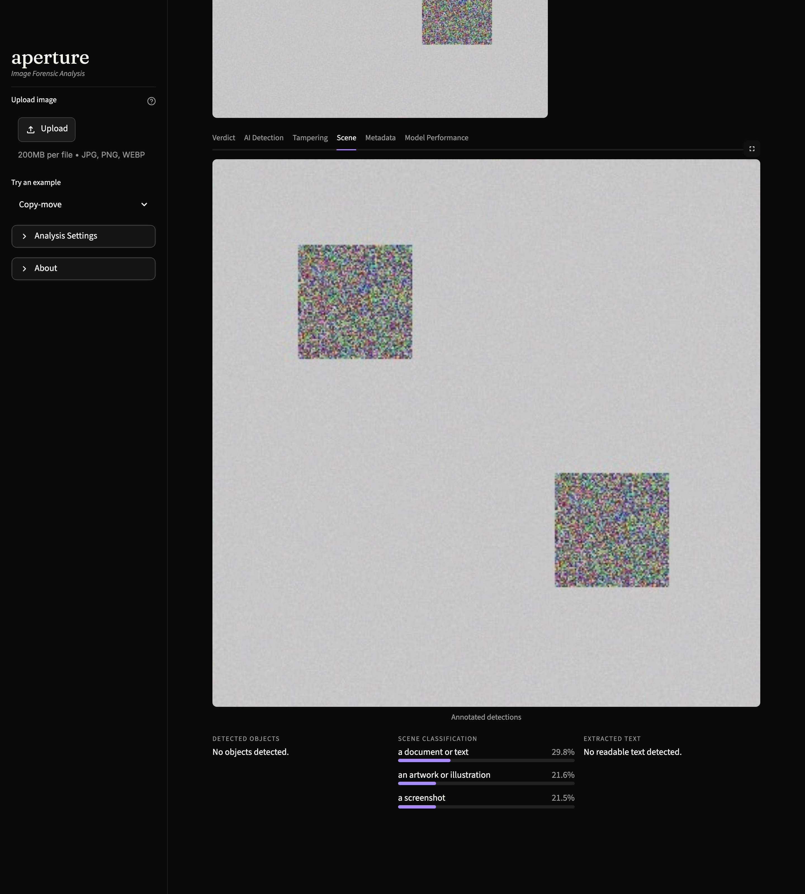
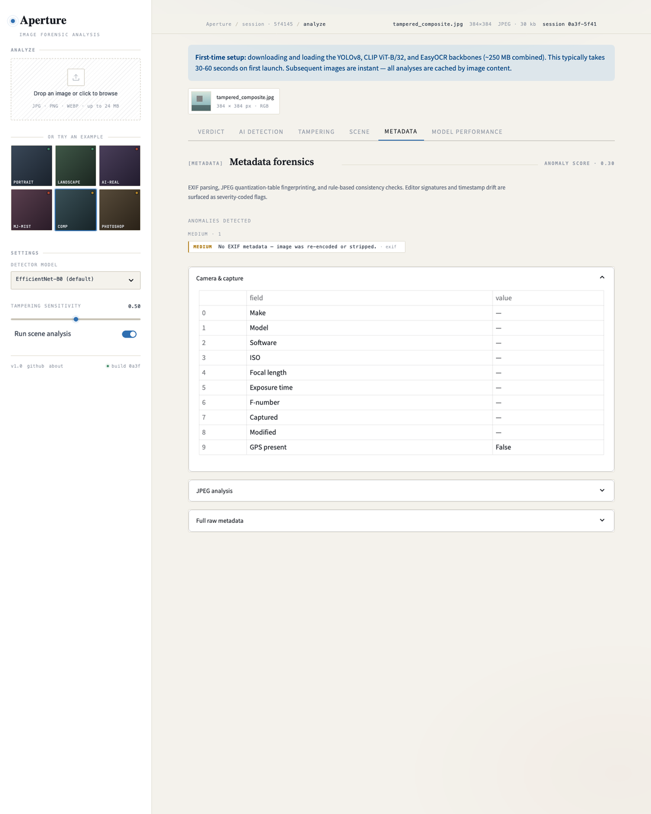
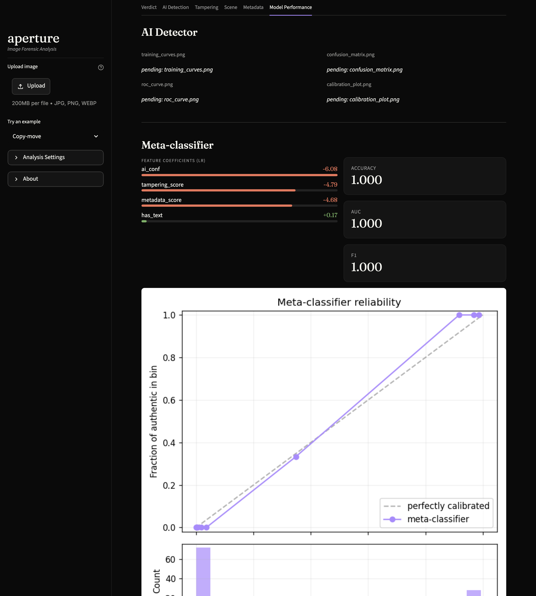

# Aperture — Image Forensic Analysis

**Live demo:** <https://nandann018-aperture-forensics.hf.space>

A multi-signal forensic verdict system for images. Four independent pipelines —
generative-origin detection, classical tampering analysis, scene understanding,
and metadata inspection — run in parallel and a Platt-calibrated meta-classifier
fuses them into a single authenticity probability with ranked, plain-English
explanations.



---

## Why multi-signal

Single-signal detectors lose on the long tail. An AI detector alone misses
Photoshop composites; EXIF inspection alone is defeated by a single re-encode;
a tampering detector alone misses born-digital generation.

Aperture is built on the premise that **multiple weak signals fused with proper
calibration beat any single strong signal**. Every verdict surfaces which
signals moved it and by how much, so reviewers can spot over-reliance on any
one pipeline.

---

## Architecture



Four pipelines run in parallel against the input image. Each emits a
normalized score in `[0, 1]`. A logistic-regression meta-classifier, Platt-
calibrated via `CalibratedClassifierCV`, fuses the four scores plus a binary
"image-has-text" flag into the final `P(authentic)` and a ranked list of
per-factor contributions.

| Pipeline | Approach | Tech |
|---|---|---|
| **Generative-origin** | Fine-tuned EfficientNet-B0 on CIFAKE with JPEG-augmented training; Grad-CAM on the last conv block | PyTorch, torchvision, pytorch-grad-cam |
| **Tampering** | ELA + noise-residual + copy-move detection fused with weights `0.4 / 0.4 / 0.2` | OpenCV, SIFT, NumPy |
| **Scene** | YOLOv8n object detection + CLIP ViT-B/32 zero-shot classification + EasyOCR text extraction | ultralytics, transformers, EasyOCR |
| **Metadata** | EXIF / IPTC parsing, JPEG quality reverse-engineered from Annex K quantization tables, 28 rule-based anomaly flags | Pillow, piexif |

---

## Interface

The app surfaces every signal as its own tab plus a fused verdict tab on top.

### Verdict — fused probability with ranked factors


### AI Detection — Grad-CAM heatmap over the input


### Tampering — ELA, noise residual, copy-move


### Scene — YOLO + CLIP + OCR


### Metadata — EXIF + JPEG + anomaly rules


### Model Performance — held-out metrics + reliability diagrams


---

## Metrics

CIFAKE held-out test split (n = 20 000):

| Metric | Value |
|---|---|
| Accuracy | **98.25 %** |
| F1 | **98.23 %** |
| Precision | **98.97 %** |
| Recall | **97.50 %** |
| AUC | **0.9987** |

Sample verdicts (full pipeline, four signals fused):

| Image | P(authentic) | Verdict | Top factor |
|---|---|---|---|
| Authentic landscape | 0.99 | authentic | tampering analysis (low) |
| AI-generated (synthetic) | 0.01 | fake | AI detector (high) |
| Tampered composite | 0.00 | fake | tampering analysis (high) |
| Borderline + text | 0.02 | fake | AI detector (medium) — text caveat surfaced |

Reliability diagram: `eval_results/calibration_meta.png` · full dump:
`eval_results/meta_classifier_summary.json`.

---

## Run locally

Python 3.10 (matches the deployment runtime).

```bash
git clone https://github.com/Nandann018-ux/Aperture.git
cd Aperture
python -m venv .venv
source .venv/bin/activate
pip install -r requirements-dev.txt
streamlit run app.py
```

First run downloads YOLOv8n (~6 MB), CLIP ViT-B/32 (~150 MB), and EasyOCR
weights (~100 MB) into the OS cache. Subsequent runs reuse them.

### Retrain the meta-classifier

```bash
python -c "from Aperture.verdict.meta_classifier import main; main()"
```

Reads `data/meta_classifier_training.csv`, fits an LR + Platt-scaled
classifier, and writes `models/meta_classifier.pkl`. The deployed app
rebuilds this on first cold start so the pickle does not need to be
checked in.

### Train the AI detector

The CIFAKE detector is trained in `notebooks/02_detector_training.ipynb`
(Colab-aware, T4 GPU). Drop `models/ai_detector_best.pt` back into the
repo, or publish it as a GitHub Release asset, to unlock the AI Detection
tab end-to-end.

---

## Deployment

The repo ships with a Docker target tuned for **Hugging Face Spaces**
(`python:3.10-slim` base, OpenCV/Torch system libraries, Streamlit on
port 7860).

```bash
docker build -t aperture .
docker run -p 7860:7860 aperture
```

The HF Space metadata (title, emoji, SDK, port) lives in
[`README_HF.md`](README_HF.md), which is injected over `README.md` only
on the HF orphan deploy.

---

## Tests

```bash
pytest tests/                            # 26 unit tests
python scripts/smoke_app.py              # end-to-end UI boot
python scripts/capture_screenshots.py    # regenerate README images
```

---

## Limitations

- **OOD evaluation pending.** Cross-generator metrics on hand-collected
  Midjourney / Flux / DALL-E 3 samples have not been produced. Treat
  cross-generator generalization as unvalidated.
- **CIFAKE-trained detector** is primarily older diffusion at 32×32
  upsampled to 224×224 — expect degraded performance on Flux, Imagen 3,
  Midjourney v6+, SDXL.
- **Metadata pipeline is rule-based, not learned.** Absence of metadata
  is treated as a flag, not proof.
- **Tampering detection is post-hoc** and sees only the pixels, so
  sophisticated edits with consistent compression and noise can fool
  all three methods.

---

## Project structure

```
Aperture/
├── app.py                     # Streamlit entry point
├── Dockerfile                 # HF Spaces Docker target
├── README.md                  # this file (GitHub-facing)
├── README_HF.md               # HF Spaces frontmatter overlay
├── Aperture/
│   ├── ai_detector/           # EfficientNet detector + Grad-CAM
│   ├── tampering/             # ELA, noise, copy-move, fusion
│   ├── scene/                 # YOLO + CLIP + EasyOCR
│   ├── metadata/              # EXIF + JPEG + anomaly rules
│   ├── verdict/               # Meta-classifier + explanations
│   ├── ui/                    # Streamlit theme + components + tabs
│   └── utils/                 # Image IO + visualization helpers
├── tests/                     # pytest suite
├── notebooks/                 # Training + evaluation
├── examples/                  # Curated example images
├── eval_results/              # Saved metrics, plots, diagrams
├── docs/                      # README assets (architecture, screenshots)
└── requirements*.txt          # Prod + dev pins
```

---

## License

MIT — see [`LICENSE`](LICENSE).
